ST558 Project 1
================
Zack Vaskalis
6/12/2020

  - [Reading and Summarizing JSON
    Datasets](#reading-and-summarizing-json-datasets)
      - [The power of JSON](#the-power-of-json)
          - [What is JSON?](#what-is-json)
          - [JSON Data Types](#json-data-types)
          - [So where is JSON used?](#so-where-is-json-used)
          - [A good way to store data?](#a-good-way-to-store-data)
      - [Possible R Packages for JSON](#possible-r-packages-for-json)
      - [NHL API JSON Data](#nhl-api-json-data)
          - [NHL Franchises](#nhl-franchises)
          - [Function 1 - getFranchises()](#function-1---getfranchises)
          - [Function 2 -
            getFranchiseTotals](#function-2---getfranchisetotals)
          - [Function 3 -
            getFranchiseSpecificTotals](#function-3---getfranchisespecifictotals)
          - [Function 4 -
            getFranchiseGoalieRecords](#function-4---getfranchisegoalierecords)
          - [Function 5 -
            getFranchiseSkaterRecords](#function-5---getfranchiseskaterrecords)
      - [Section for EDA - Exploratory Data
        Analysis](#section-for-eda---exploratory-data-analysis)
          - [EDA Plots](#eda-plots)
          - [EDA Tables](#eda-tables)

# Reading and Summarizing JSON Datasets

A Vignette using National Hockey League (NHL) Application Programming
Interface (API) - No “Hat Tricks” here\!


## The power of JSON

### What is JSON?

Before we can begin investigating the datasets provided by the [NHL
Records ‘Franchise’
API](https://gitlab.com/dword4/nhlapi/-/blob/master/records-api.md), we
must first discuss what JSON is and what tools do we have at our
disposal in R to handle reading such data into R.

JSON stands for **JavaScript Object Notation** and is a
language-independent data format, derived from *JavaScript*, but is an
open standard file and data interchange format used to store and
transmit data. Simply put, JSON files are plain text that are readable
by humans and can be easily opened and inspected. JSON data files use
the extension `.json` and encode attribute-value pairs, such as
`"firstName": "Zachary"`, simple array data types such as `"sentence":
["Hello", "World", "I", "am", "Zack"]`, to more complicated data
structures or objects that can be stored (in a file or buffer),
transmitted (via network connection) and reconstructed later, back into
a more complicated structure, like a matrix, data frame, or tibble,
potentially in a completely different environment. JSON was developed in
part to solve the problem for the need of a real-time server-to-browser
communication protocol which was independent of popular browser-plugins
applets like Flash and Java, which were popular at the start of the new
millenium. This is exactly why JSON has become so popular with widespead
use - virtually every programming language can process and deal with
plain text data, and the files are easy to transfer over the internet.

### JSON Data Types

JSON has 5 basic data types: numbers, strings, boolean or logical
(including the empty value, `NULL`), arrays, and objects. These 5 basic
JSON data types, adapted from the [JSON wikipedia
page](https://en.wikipedia.org/wiki/JSON) are outlined below. Whitespace
special characters such as spaces, horizontal tabs, newlines, and
returns are allowed and typically ignored outside of values and
punctuation marks, but are maintained when contained within string
values for instance.

  - Number: a signed decimal number (that can consist of a fractional
    component and/or exponential component), but cannot be a non-number.
  - String: a sequence of Unicode characters, delimited by
    double-quotation marks, and supports escaping syntax utilizing a
    backslash.
  - Boolean: (or Logical) dichotomous data type or flag consisting of
    one of two values: `TRUE` or `FALSE`. Also allows for empty value
    `NULL`.
  - Array: an ordered list of values where each one may be a different
    type, delimited using square bracket notation with elements
    separated by commas.
  - Object: a collection of name–value string pairs, delimited by curly
    brackets and separated by commas. Within each pair, a colon
    character separates the name from its value.

### So where is JSON used?

A great little quick guide tutorial and overview on JSON can be found
[here](https://www.tutorialspoint.com/json/json_quick_guide.htm#:~:text=JSON%20format%20is%20used%20for,used%20with%20modern%20programming%20languages.)
if you are interested in a more extensive dive with some examples and
applications using JSON in several programming languages. There are
several areas where JSON is used, however, we’ve already discussed the
main one which is primarily for used for serializing and transmitting
structured plain-text data over a network connection, transmitting this
data between a server and various web applications, serving as an
alternative to, and in some regards seems to be slowly replacing
Extensible Markup Language (XML). For more on this somewhat heated
debate, check out these articles:

  - [XML is toast, long live
    JSON](https://www.cio.com/article/3082084/xml-is-toast-long-live-json.html)
  - [JSON vs XML](https://hackr.io/blog/json-vs-xml)
  - [Has JSON Overtaken
    XML](https://www.c-sharpcorner.com/article/is-json-overridden-xml/#:~:text=XML%20has%20done%20a%20lot,still%20exist%20in%20this%20world.)
  - [Is XML Dying?](https://blog.submain.com/json-and-xml-dying/)

Tied to the reason above, web services and Application Programming
Interfaces (APIs) use JSON format to provide public data. Thus, it is
used nearly everywhere, in particular in areas which were previously
troubling such as with cross-domain communication. As mentioned
previously, with the dawn of JavaScript and XML, AJAX (Asynchronous
JavaScript and XML), it became of greater importance for websites to be
able to load data sources quickly, asynchronously, or in the background,
all without slowing down the speed of loading and rendering the page.
Modern sites, like for example Twitter, use RSS (**R**esource
Description Framework **S**ite **S**ummary) feeds, which is essentially
XML-formatted plain text originally designed as a metadata data model.
Before we get too far down the proverbial rabbit hole, RSS feeds became
popular because on the server-side they are easy to use and import.
However, if you try to use AJAX on them, you will get errors, because
they are only able to load in the same domain the request is being made
from - generally querys will result in errors. This is truly where JSON
shines, overcoming this inability to communicate across domains, and
therefore is able to send data packets back to the domain making the
call or query. This is why we will be using JSON to query the NHL Hockey
API without worry.

### A good way to store data?

For all of the reasons we have discussed above, JSON is a great way to
store data because it is light-weight, easy to read and write,
plain-text based, highly interoperable since it is program language
independent, and overcomes the cross-domain communication barrier -
where JSON files are easily sent between servers. This may not be true
for all data - especially extremely private data like social security
numbers and income records for example. Although JSON would be able to
handle the data, you would probably want this type of data stored on
more securely encrypted servers, which are not easily accessed. But
public data, especially governmental data, national health organization
data, or even as in our example here, major league sports team data,
JSON is completely appropriate and easy to use, besides being a great
way to store data.

## Possible R Packages for JSON

So now that we have come to a basic level of understanding what JSON
data is, where it is used, and why it is a good way to store data, we
need to learn how to deal with JSON data. This portion of the discussion
is highly programming language specific, and in our case for the rest of
this vignette, the R programming language will be the method of choice.
Thus, to handle JSON data in R, it is necessary to discuss the packages
and libraries, along with their associated functions, which were
designed and made available for reading in JSON data in R. There are
several major packages for handling JSON data in R, which are as
follows:

  - `rjson`
  - `RJSONIO`
  - `jsonlite`
  - `tidyjson`

There is a great resource, [A biased comparsion of JSON packages in
R](http://rstudio-pubs-static.s3.amazonaws.com/31702_9c22e3d1a0c44968a4a1f9656f1800ab.html),
which compares the top three packages listed above, and is in favor of
`jsonlite`, which I would have to agree with, out of that list jsonlite
is by far the best, for some of the reasons mentioned in that resource.

However, published on the [CRAN R Project
website](https://cran.r-project.org/) a little under two weeks ago, is a
new package `tidyjson` which seems to have some promise. What is
especially intriguing is the writeup on the `tidyjson` package page
itself which can be found on the [CRAN R Project website for
tidyjson](https://cran.r-project.org/web/packages/tidyjson/vignettes/introduction-to-tidyjson.html#:~:text=Tidyjson%20provides%20a%20grammar%20for,work%20with%20in%20the%20tidyverse.)
I am presenting it here so that you know it is available as a resource.
With it being so new, I believe it is best to utilize `jsonlite`.

The resource mentioned previously, [A biased comparsion of JSON packages
in
R](http://rstudio-pubs-static.s3.amazonaws.com/31702_9c22e3d1a0c44968a4a1f9656f1800ab.html)
describes many benefits for using `jsonlite` to deal with JSON data that
I agree with, so I will not rehash those here. Additionally, however,
besides `jsonlite` being the package we’ve explored so far in this
course, I believe there are other benefits. From the [CRAN R webiste for
jsonlite](https://cran.r-project.org/web/packages/jsonlite/index.html)
we see that `jsonlite` was originally built as a fork of `RJSONIO` but
has since been completely rewritten. The site also claims that
`jsonlite` is a fast, robust, high-performance JSON parser and generator
for R, optimized for statistical data and the web, and offers flexible,
robust, high performance tools for working with JSON in R and is
particularly powerful for building pipelines and interacting with a web
API. These are exactly all the things we want to do as part of this
vignette, so `jsonlite` seems like the perfect choice. Finally,
`jsonlite`, in addition to converting JSON data to R objects, contains
functions that can stream, validate, and prettify JSON data. Again, this
is what we want to do, so why not use it?\!?

## NHL API JSON Data

Now that we know all about JSON data and the R packages, namely
`jsonlite` that can help us deal with reading in such JSON data and
creating R objects, we can now begin to explore the NHL data provided by
the [NHL Records ‘Franchise’
API](https://gitlab.com/dword4/nhlapi/-/blob/master/records-api.md).

We will use R to build 5 functions that return well-formatted, parsed
data from this API. The code chunks we develop will use the following
NHL Records Franchise API calls:

1.  /franchise (Returns id, firstSeasonId and lastSeasonId and name of
    every team in the history of the NHL)
2.  /franchise-team-totals (Returns Total stats for every franchise (ex
    roadTies, roadWins, etc))
3.  /franchise-season-records?cayenneExp=franchiseId=ID (Drill-down into
    season records for a user-specified franchise ID)
4.  /franchise-goalie-records?cayenneExp=franchiseId=ID (Goalie records
    for a user-specified franchise ID)
5.  /franchise-skater-records?cayenneExp=franchiseId=ID (Skater records,
    for a user-specified franchise ID)

### NHL Franchises

library packages needed:

`library(tidyverse)`  
`library(pipeR)`  
`library(DT)`  
`library(knitr)`  
`library(dplyr)`  
`library(jsonlite)`  
`library(httr)`  
`library(ggplot2)`  
`library(DBI)`

### Function 1 - getFranchises()

This first function queries the NHL Franchise Database and returns the
name of every team in the history of the NHL.

``` r
#Function to get Franchises
  getFranchises <- function(...)
  {
#franchise json data.  Set up components of URL for API query using GET() function
    query_prefix <- 'https://records.nhl.com/site/api'
    query_suffix <- '/franchise'
    franchiseJSON <- GET(paste0(query_prefix,query_suffix))

#Transform Data from JSON to a data frame
    franchiseData <- fromJSON(content(franchiseJSON,"text", encoding = "UTF-8"),flatten = TRUE) 

#Rename id to franchiseID
    franchiseData <- rename(franchiseData$data, franchiseId = id)
    franchiseData

#Reorganize the data frame with columns in a more usable order
    franchiseData %>% select(mostRecentTeamId, franchiseId, teamPlaceName, teamCommonName,
                             firstSeasonId, lastSeasonId) %>%
      arrange(teamPlaceName) %>>% (~ franchiseData)
    franchiseDT <- datatable(franchiseData, rownames = FALSE)

#Initialize franchiseSelection Table for user to be able to see correct franchise ID for functions #3 - 5.
    franchiseSelection <- franchiseData

#return Data
    return(franchiseSelection)
  }
```

Then, once that is created you can simply call the function nicely
wrapped in a datatable:

``` r
  datatable(getFranchises())
```

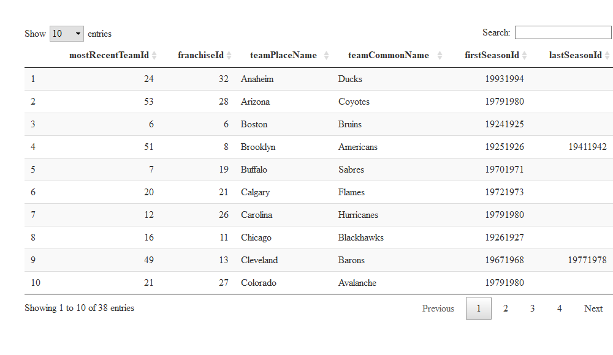<!-- -->

### Function 2 - getFranchiseTotals

This first function queries the NHL Franchise Database and returns total
stats for every franchise.

``` r
#function to get Franchise Totals
  getFranchiseTotals <- function(...)
  {
#franchise team totals json data.  Set up components of URL for API query using GET() function
    query_prefix <- 'https://records.nhl.com/site/api'
    query_suffix <- '/franchise-team-totals'

#Get JSON Data
    franchiseTeamTotsJSON <- GET(paste0(query_prefix,query_suffix))
    franchiseTeamTotsData <- fromJSON(content(franchiseTeamTotsJSON,"text", encoding = "UTF-8"),flatten = TRUE)

#Reorganize the data frame with columns in a more usable order
    franchiseTeamTotsDataTBL <- tibble::as_tibble(franchiseTeamTotsData)
    franchiseTeamTotsDataTBL$data %>%
      select(franchiseId, teamName, triCode, wins, losses, ties, overtimeLosses, shutouts, shootoutWins,
             shootoutLosses, penaltyMinutes, points, pointPctg, homeWins, homeLosses, homeTies,
             homeOvertimeLosses, roadWins, roadLosses, roadTies, roadOvertimeLosses, gameTypeId,
             gamesPlayed, goalsAgainst, goalsFor, id, teamId, activeFranchise, firstSeasonId, lastSeasonId) %>%
      arrange(teamName) %>>% (~ franchiseTeamTotsDataTBL)

#return Data
    return(franchiseTeamTotsDataTBL)
  }
```

Then you can simply call the function to return the data. Here I have
again wrapped it in a datatable, and selected only the first 8 columns
because the data is both wide and long.

``` r
  franchiseFull <- getFranchiseTotals()
  datatable(franchiseFull[c(1:8)])
```

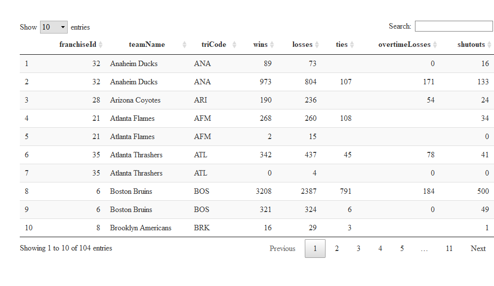<!-- -->

This little intermediary step creates a nice datatable of just franchise
names and IDs for the user to look at to request a specific team
franchise in the last 3 functions.

``` r
  franchiseSelection <- getFranchises()
  franchiseSelection %>% select(franchiseId, teamPlaceName, teamCommonName) %>% arrange(teamPlaceName) %>>%
    (~ frSelect) %>% datatable(frSelect,rownames = FALSE)
```

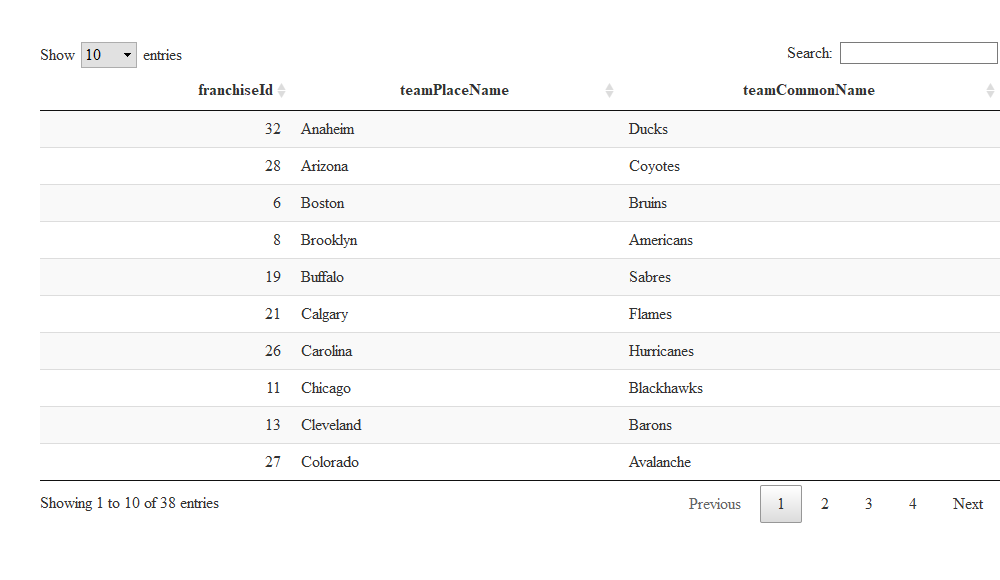<!-- -->

### Function 3 - getFranchiseSpecificTotals

So, once again, as the name might suggest, this function returns the
records for a specific franchise.

``` r
#Function to get Franchise Specific Totals
  getFranchiseSpecificTotals <- function(FranID, ...)
  {
#Specific franchise team totals json data
    query_prefix <- 'https://records.nhl.com/site/api'
    query_suffix <- '/franchise-season-records?cayenneExp=franchiseId='

#Get Specific Team Input from User
    specific_franchiseID <- FranID

#Get JSON Data
    franchiseIDTeamTotsDataJSON <- GET(paste0(query_prefix,query_suffix,specific_franchiseID))
    franchiseIDTeamTotsData <- fromJSON(content(franchiseIDTeamTotsDataJSON,"text", encoding = "UTF-8"),
                                        flatten = TRUE)

#Reorganize the data frame with columns in a more usable order
    franchiseIDTeamTotsDataTBL <- tibble::as_tibble(franchiseIDTeamTotsData)
    franchiseIDTeamTotsDataTBL$data %>% select(franchiseName, franchiseId, id:winlessStreakDates) %>>%
      (~ franchiseIDTeamTotsDataTBL)

#Return Data    
    return(franchiseIDTeamTotsDataTBL)
  }
```

Once again we can simply call the function to get the data, with the
caveat this time of providing the franchiseId as an argument. Again, for
aesthetics it is presented wrapped in a datatable and transposed since
it was returned as a 1x57 data frame, the `t()` helped to transform it
from wide to long as a 57x1.

``` r
#Two test function calls - one for my favorite team, GO PENS! & one for the hometown favorite Hurricanes!
#function to pull records for Pittsburgh Penguins

  datatable(t(getFranchiseSpecificTotals(17)), colnames = "")
```

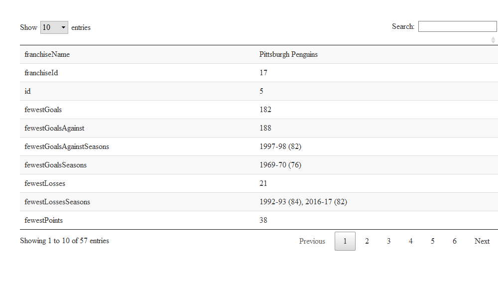<!-- -->

``` r
#Function to pull records for Carolina Hurricanes

  datatable(t(getFranchiseSpecificTotals(26)), colnames = "")
```

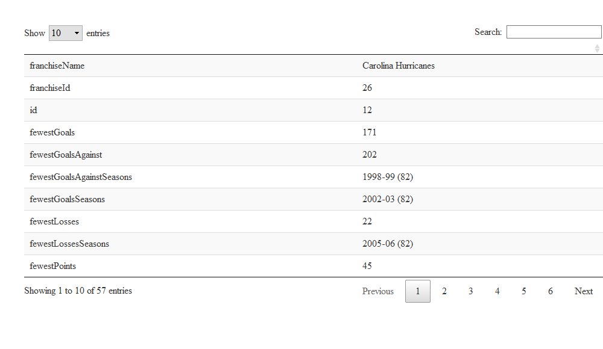<!-- -->

### Function 4 - getFranchiseGoalieRecords

This function returns the goalie records for a specific franchise.

``` r
#Function to get Franchise Goalie Records
  getFranchiseGoalieRecords <- function(FranID, ...)
  {
#Specific franchise Goalie Records json data
    query_prefix <- 'https://records.nhl.com/site/api'
    query_suffix <- '/franchise-goalie-records?cayenneExp=franchiseId='

#Get Specific Team Input from User
    specific_franchiseID <- FranID

#Get JSON Data
    franchiseIDGoalieJSON <- GET(paste0(query_prefix,query_suffix,specific_franchiseID))
    franchiseIDGoalieData <- fromJSON(content(franchiseIDGoalieJSON,"text", encoding = "UTF-8"),
                                      flatten = TRUE)

#Reorganize the data frame with columns in a more usable order

    goalieDF <- franchiseIDGoalieData$data
    goalieDF %>% select(franchiseId, franchiseName, firstName, lastName, gamesPlayed, wins,
                        losses, ties, mostSavesOneGame, mostShotsAgainstOneGame,
                        mostGoalsAgainstOneGame, id:wins) %>>% (~ goalieDF)

#Return data
    return(goalieDF)
  }
```

Once again, we call the function with the franchiseId as a provided
argument. Also, this data is wide and long again, so only the first 8
columns of data are presented.

``` r
#Two test function calls - one for my favorite team, GO PENS! & one for the hometown favorite Hurricanes!
#function to pull records for Pittsburgh Penguins and print out first 8 columns to display well on the page

  goalieFull <- getFranchiseGoalieRecords(17)
  datatable(goalieFull[c(1:8)])
```

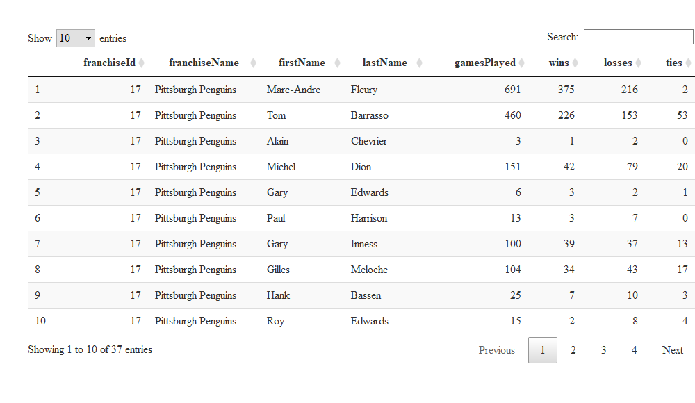<!-- -->

``` r
#Function to pull records for Carolina Hurricanes and print out first 8 columns to display well on the page

  goalieFull <- getFranchiseGoalieRecords(26)
  datatable(goalieFull[c(1:8)])
```

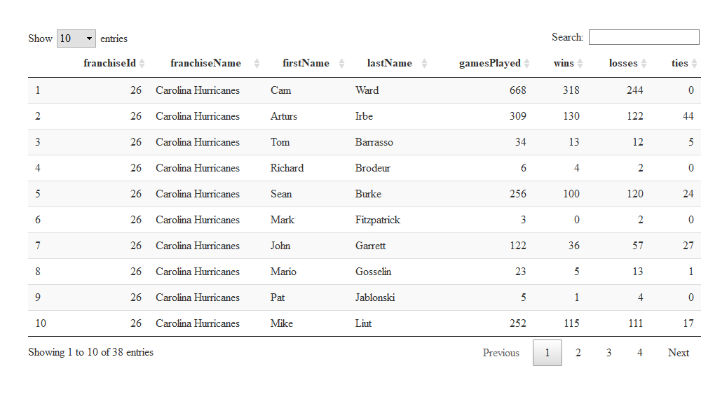<!-- -->

### Function 5 - getFranchiseSkaterRecords

The fifth and final function returns the skater records for a specific
user-designated franchise.

``` r
#Function to get Franchise Skater Records
  getFranchiseSkaterRecords <- function(FranID, ...)
  {

#Specific franchise Skater Records json data
    query_prefix <- 'https://records.nhl.com/site/api'
    query_suffix <- '/franchise-skater-records?cayenneExp=franchiseId='

#Get Specific Team Input from User
    specific_franchiseID <- FranID
    
#Get JSON Data
    franchiseIDSkaterJSON <- GET(paste0(query_prefix,query_suffix,specific_franchiseID))
    franchiseIDSkaterData <- fromJSON(content(franchiseIDSkaterJSON,"text", encoding = "UTF-8"),
                                      flatten = TRUE)

#Reorganize the data frame with columns in a more usable order

    skaterDF <- franchiseIDSkaterData$data
    skaterDF %>% select(franchiseId, franchiseName, firstName, lastName, positionCode, 
                        gamesPlayed, goals, assists, penaltyMinutes, mostGoalsOneGame, mostAssistsOneGame,
                        mostPenaltyMinutesOneSeason, id:seasons) %>% arrange(desc(goals)) %>>% (~ skaterDF)
    
#Return Data
    return(skaterDF)
  }
```

Once again, we call the function with the franchiseId as a provided
argument. Also, this data is wide and long again, so only the first 8
columns of data are presented.

``` r
#Two test function calls - one for my favorite team, GO PENS! & one for the hometown favorite Hurricanes!
#function to pull records for Pittsburgh Penguins. Variable teamFull has full dataset. Needed to subset to display
  skaterFull <- getFranchiseSkaterRecords(17)
  datatable(skaterFull[c(1:8)])
```

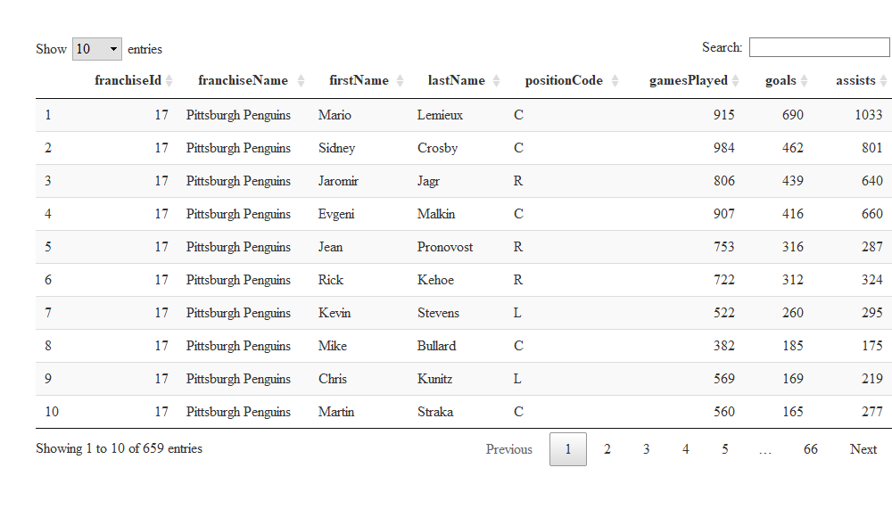<!-- -->

``` r
#Function to pull records for Carolina Hurricanes and print out first 8 columns to display well on the page

  skaterFull <- getFranchiseSkaterRecords(26)
  datatable(skaterFull[c(1:8)])
```

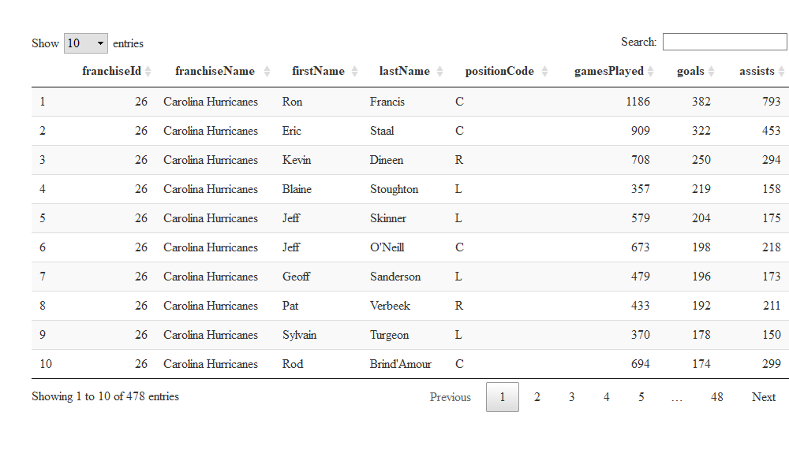<!-- -->

## Section for EDA - Exploratory Data Analysis

For this project I could not help but use the Pittsburgh Penguins. They
have been my favorite team forever. Even though I grew up in the
Scranton area (on the opposite side of PA), I have always been a Pens
fan. Additionally, the little Pens play in Wilkes-Barre, so I got to see
many of the Pens players play before they made it to the big leagues, or
where they would come to recoup an injury. Thus, I will use the Penguins
Skater dataset as much as I can for the remainder of this project.

### EDA Plots

Below you will see several different plots. The first is a simple
horizontal bar chart displaying the counts by position for the all-time
Pittsburgh Penguins Skaters, as far as this dataset is accurate from the
NHL API. We see what would appear to be a larger number of defensemen,
but that is actually a little visually misleading, since Right Wingers,
Left Wingers, and Centers all count as “offensemen.”

The second plot helps differentiate a bit more, in that the data is
broken down by active and non-active or retired players. The black bars
are largest and represent the non-active/retired players. This should
make intuitive sense as any given hockey team can only have *23* number
of players on the roster in any given season.

The third graph is a boxplot showing the most points scored in a single
game across all position types. As might be expected, a center has the
absolute highest points with 8. This is none other than the great Mario
Lemieux\! However, it is quite surprising to me, that in terms of a
statistical comparison of medians using an “eyeball” test rather than a
nonparametric medians test like Kruskal-Wallis, they appear to be equal
across offensemen, and only unequal compared to defensemen, which makes
sense given thier roles on the team.

The two final plots are scatterplots, plotting total goals on the x-axis
by penalty minutes on the y-axis. The first color-codes the scatter
points by position code, the second codes the points by the created
variable offDef which stands for offense / defense, and is a grouping of
the 3 offensive position types. These graphs allow us to see that
typically, the defensive players land themselves in the penalty box
quite frequently, and quite often have much less than 50 total goals,
whereas offensemen spend less time in the penalty box and more time
scoring. For the purpose of this analysis I did not have time to dive
into the data to see who the great ones are in the upper right corner,
representing prowess in terms of scoring ability as well as the ability
to thrown down and earn substantial time in the box. It really intrigues
me to know who these players are\!

``` r
#Get FULL Pittsburgh Skater Dataset

  skaterFull <- getFranchiseSkaterRecords(17)
  #datatable(skaterFull)
  
#Penguins Official Colors from: https://teamcolorcodes.com/pittsburgh-penguins-color-codes/
  pensColors <- c("#000000", "#CFC493", "#FCB514", "#FFFFFF")
  pensColors2 <- c("#000000", "#000000", "#000000", "#000000", "#CFC493", "#CFC493",
                   "#CFC493", "#CFC493")

#All time Pens Skaters by Position
  g1 <- ggplot(data=skaterFull, aes(x = positionCode))
  g1 + geom_bar() + labs(x = "Penguins Skater Position",
                        title = "Pittsburgh Penguins All Time Skater Positions") +
    scale_x_discrete(labels = c("Center", "Defense", "Left Wing", "Right Wing")) +
    coord_flip()
```

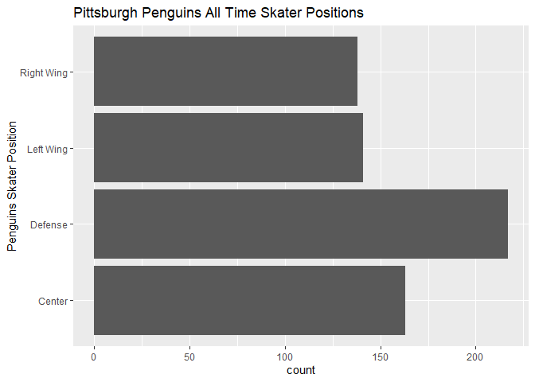<!-- -->

``` r
#All time Pens Skaters by Position and Active = Yes/No Status
  g2 <- ggplot(data=skaterFull, aes(x = positionCode, group = activePlayer))
  g2 + geom_bar(fill=pensColors2, position = "dodge") +
    labs(x = "Penguins Skater Position", title = "Pittsburgh Penguins All Time Skater Positions") +
    scale_x_discrete(labels = c("Center", "Defense", "Left Wing", "Right Wing")) +
    scale_fill_discrete(name = "Active Player?", labels = c("FALSE" = "No", "TRUE" = "Yes"))
```

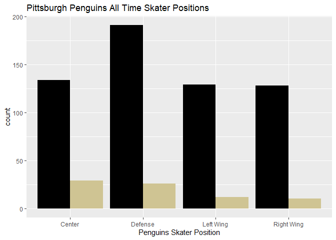<!-- -->

``` r
#All time Pens Skater Most Points in One Game by Position
  g3 <- ggplot(skaterFull, aes(x = positionCode, y = mostPointsOneGame))
  g3 + geom_boxplot(fill=pensColors[3]) +
    labs(x = "Penguins Skater Position",
         title = "Pittsburgh Penguins Most Points in One Game by Position") +
    scale_x_discrete(labels = c("Center", "Defense", "Left Wing", "Right Wing"))
```

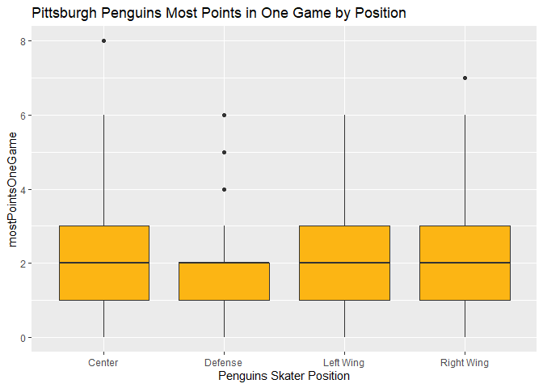<!-- -->

``` r
#All time Pens Skater Scatterplot of Goals vs Penalty Minutes
  ggplot()+
  geom_point(data = skaterFull, aes(x = goals, y = penaltyMinutes, color = positionCode),size=4) +
      scale_color_manual(values = pensColors) +
    labs(x = "Total Goals", title = "Pittsburgh Penguins Goals by Penalty Minutes Colored by Position")
```

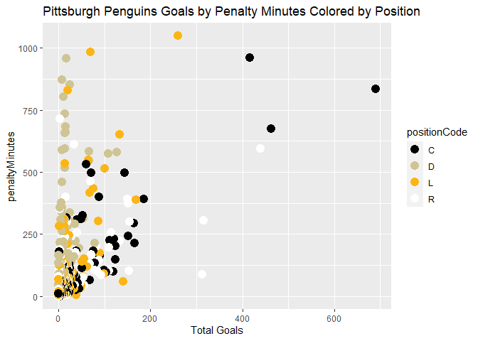<!-- -->

``` r
#New Variable OffDef: Take positionCOde and Transform: C, L, R = Offense, D = Defense
  skaterFull <- mutate(skaterFull, OffDef = ifelse((positionCode == "D"), "Defense", "Offense"))
      
#Run Same plot again, now with new variable
  ggplot()+
  geom_point(data = skaterFull, aes(x = goals, y = penaltyMinutes, color = OffDef),size=4) +
      scale_color_manual(values = pensColors) +
    labs(x = "Total Goals", title = "Pittsburgh Penguins Goals by Penalty Minutes Colored by Position")
```

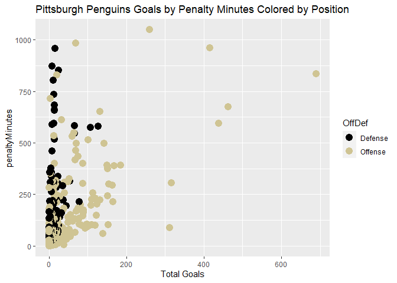<!-- -->

### EDA Tables

Below you will see several different tables and output from the R
console summarizing some statistics related to the Penguins Skaters
dataset.

The first piece of output is a small tibble, examining means and
standard deviations for offensemen and defensemen for 3 variables:
points, assists, and goals. This table is important because it
corroborates the last two scatterplots and confirms numerically that
defensemen score much less than the offensemen, although it is worthy to
note the mean assists are much closer together than the points or goals,
although there is quite a great deal of variance contained in the
disributions of assists across the two groups.

The second table is a summary table for points, goals, assists, and
penalty minutes for the entire set of Pens skaters. The data included
are minimums and maximums, means and standard deviations, as well as the
1st and 3rd quartiles. The most interesting thing to me here is that
there are players who literally did nothing - but probably still got
paid\! The minimum across each category is 0, which again to me, was
highly unexpected.

The final two pieces of output are 3 way contingency tables showing the
most points in a game, across position type in the first one, and across
offense/defense in the second one, both broken apart by inactive and
active respectively. Both sets of tables seem to show that the
youngsters have some big skates to fill and have some catching up to do
if they want to compete with the legendary old timers, particularly the
centers, but really the offense in general.

``` r
#Get FULL Pittsburgh Skater Dataset

  skaterFull <- getFranchiseSkaterRecords(17)
  #datatable(skaterFull)

#New Variable OffDef: Take positionCOde and Transform: C, L, R = Offense, D = Defense
  skaterFull <- mutate(skaterFull, OffDef = ifelse((positionCode == "D"), "Defense", "Offense"))  

#Numerical Summary of means and standard deviations for points, assists, goals, and penalty minutes
  skaterFull %>% group_by(OffDef) %>% summarize(avg_points = mean(points), sd_points = sd(points),
                                                avg_assists = mean(assists), sd_assists = sd(assists),
                                                avg_goals = mean(goals), sd_goals = sd(goals),
                                                avg_penaltyMin = mean(penaltyMinutes),
                                                sd_penaltyMin = sd(penaltyMinutes))
```

    ## `summarise()` ungrouping output (override with `.groups` argument)

    ## # A tibble: 2 x 9
    ##   OffDef avg_points sd_points avg_assists sd_assists avg_goals sd_goals
    ##   <chr>       <dbl>     <dbl>       <dbl>      <dbl>     <dbl>    <dbl>
    ## 1 Defen~       37.9      67.9        29.7       52.8      8.16     15.6
    ## 2 Offen~       64.1     153.         37.4       91.7     26.8      62.1
    ## # ... with 2 more variables: avg_penaltyMin <dbl>, sd_penaltyMin <dbl>

``` r
#Numerical Summary Statistics for Penguins Skaters
  summaryTBL <- tibble(summary(skaterFull$points, digits = 4), summary(skaterFull$goals, digits = 4),
                       summary(skaterFull$assists, digits = 4), summary(skaterFull$penaltyMinutes, digits = 4))
  summaryTBL <- rename(summaryTBL, "points" = "summary(skaterFull$points, digits = 4)",
                       "goals" = "summary(skaterFull$goals, digits = 4)" ,
                       "assists" = "summary(skaterFull$assists, digits = 4)",
                       "Penalty Minutes" = "summary(skaterFull$penaltyMinutes, digits = 4)")
  attr(summaryTBL, "row.names") <- c("Min.", "1st Qu.", "Median", "Mean", "3rd Qu.", "Max.")
  datatable(summaryTBL)
```

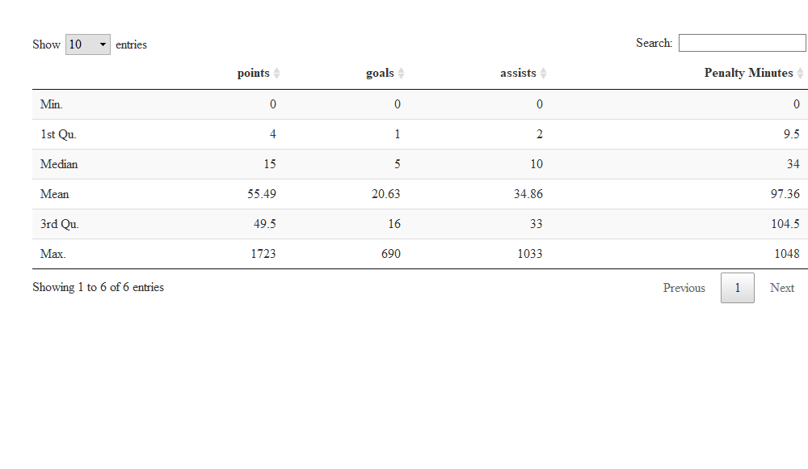<!-- -->

``` r
#Three way contingency table to show most points in one game by position code
#Tables are separated by active (TRUE) and non-active (FALSE) players
  table(skaterFull$positionCode,skaterFull$mostPointsOneGame,skaterFull$activePlayer)
```

    ## , ,  = FALSE
    ## 
    ##    
    ##      0  1  2  3  4  5  6  7  8
    ##   C 16 19 43 29 18  4  4  0  1
    ##   D 22 51 72 31 11  3  1  0  0
    ##   L 14 26 43 32 10  2  2  0  0
    ##   R 14 26 40 29 11  3  4  1  0
    ## 
    ## , ,  = TRUE
    ## 
    ##    
    ##      0  1  2  3  4  5  6  7  8
    ##   C  1  7 10  7  1  2  1  0  0
    ##   D  1  8 11  3  2  1  0  0  0
    ##   L  0  2  3  5  1  1  0  0  0
    ##   R  0  1  2  4  2  1  0  0  0

``` r
#Another Three way contingency table using created variable OffDef show most points in one game
#by Offense vs Defense.  Tables are again separated by active (TRUE) and non-active (FALSE) players
  table(skaterFull$OffDef,skaterFull$mostPointsOneGame,skaterFull$activePlayer)
```

    ## , ,  = FALSE
    ## 
    ##          
    ##             0   1   2   3   4   5   6   7   8
    ##   Defense  22  51  72  31  11   3   1   0   0
    ##   Offense  44  71 126  90  39   9  10   1   1
    ## 
    ## , ,  = TRUE
    ## 
    ##          
    ##             0   1   2   3   4   5   6   7   8
    ##   Defense   1   8  11   3   2   1   0   0   0
    ##   Offense   1  10  15  16   4   4   1   0   0
